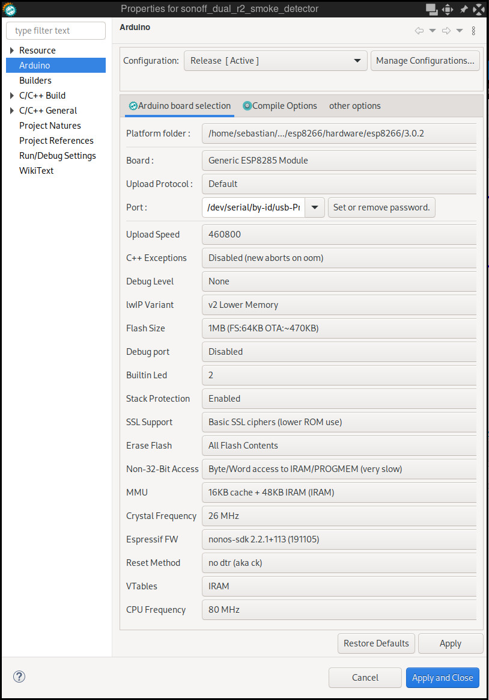

Arduino Program
===============

I prefer to write my Arduino stuff with the [SloeberIDE](https://eclipse.baeyens.it/), which is tweaked Eclipse with all the Arduino stuff integrated.

The Program can be found in *sonoff_dual_r2_smoke_detector*

All tweaks that need to be made can be found in *config.h* file.

It uses the [EspMQTTClient](https://github.com/plapointe6/EspMQTTClient) for MQTT Communication.

Description
-----------

1) On startup the program 
    * establishes the connection to your WiFi 
    * connects to the MQTT Broker
        * When WiFI and MQTT is connected the onboard LED goes on.
2) It publishes state state of the relays per MQTT.
3) Now the states of the relais may be switched per MQTT.
4) When the smokedetector causes an alarm
    * The relais will be turned off.
    * The state of the relais will be published.
    * The onboard LED starts flashing very fast.
5) When the alarm of the smokedetector has gone away
    * The onboard LED flashes slower
    * But the relais will be kept switched off
6) Pressing the onboard Button will enable the normal operation mode.

License
-------
The whole arduino project is licensend under GPLv3, as the used MQTT Library is.

Sloeber-IDE Settings
====================

Arduino Settings
----------------
