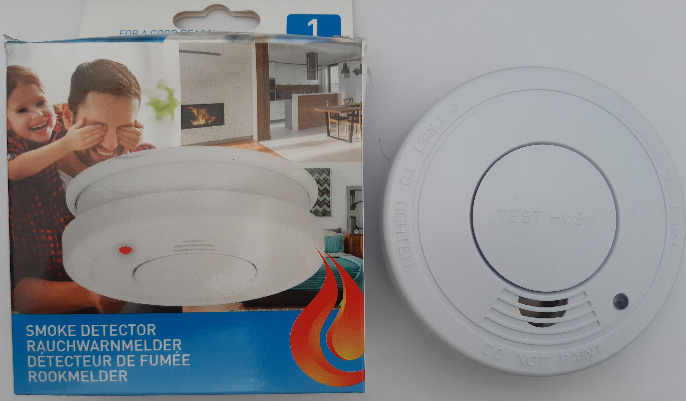
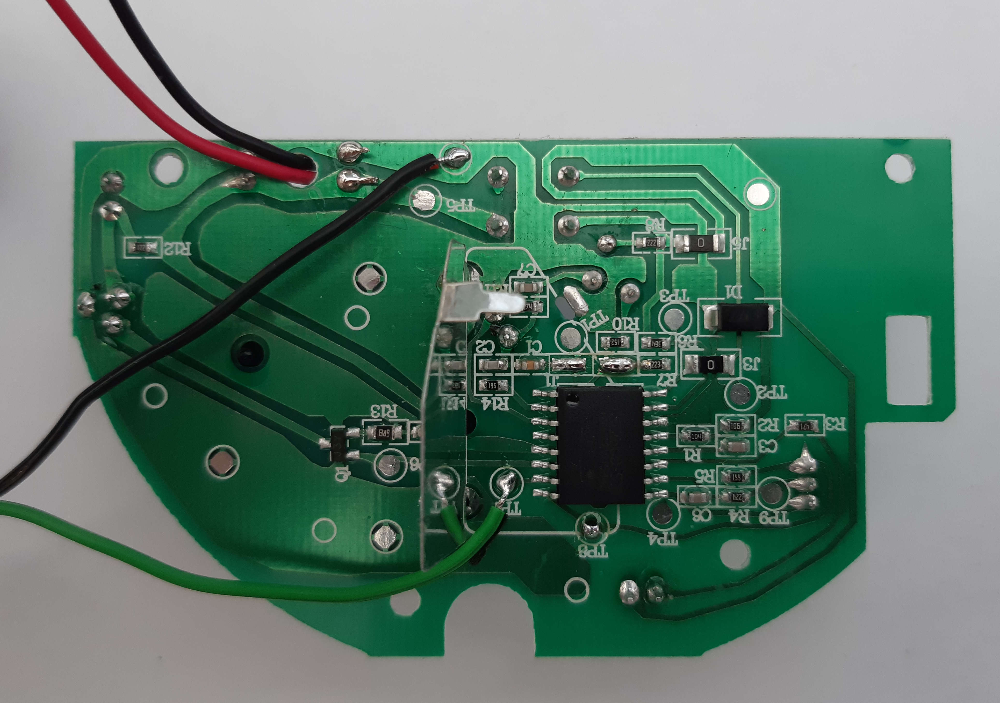
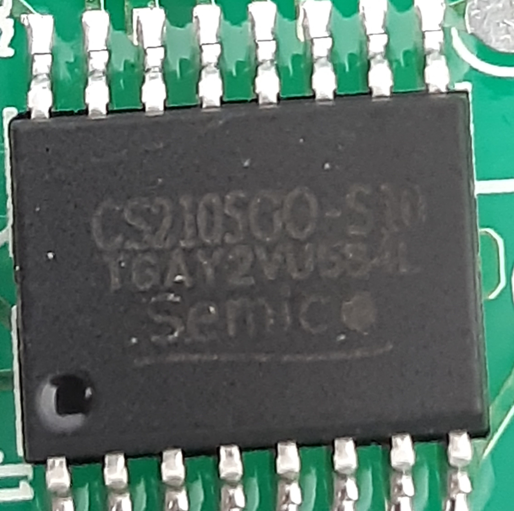

Grundig Smoke Detector
======================

Taking apart
------------
I bought the cheapest smoke detector that I was able to find at "Thomas Phillips" (german closeouts retailer) for arround 5€

I took it apart (I was also happy to find screws for everything, so taking it apart was a very step)

Also the siren is connected by a connector, makes all the upcoming testing less noisy. So I removed the siren for further testing.

After bending up the metal shield I found the an *CS2105GO-S10* IC

Please ignore the second green and black for a moment.

Short google search for hoping to find a datasheet later, I found [a post in a german microcontroller and electronics community](https://www.mikrocontroller.net/topic/190643) that states that this IC should be mostly compatible to the [MC15012](https://www.nxp.com/docs/en/data-sheet/MC145012.pdf).

Looking that first page of the datasheet showed there is an *I/O* Pin at port 7.

And the features listing stated

* *I/O Pin Allows Units to be Interconnected for Common Signalling*

Without looking any deeper into the datasheet I tried to find out what happens on the *I/O Pin*.

Looking at the PCB I found the next nice suprise, a test point, directly attached to the pin.

I used my Multimeter to measure the voltage on the *I/O Pin* when an alarm was triggered and when no alarm was triggered.

* 0V 
    * when no alarm was triggered
* 9.5V
    * when an alarm was triggered

Here we found the signal we can use for further processing. 

But with a voltage of arround 9.5V not directly connectable to a GPIO for further processing.

Fortunately the signal is active high: So I decided to use a plain Voltage Diver using two resistors connected in series to lower the voltage to securely usable voltage.

Voltage Divider
---------------
I calculated how the resistor values for voltage divider have to be so that we can hook the signal directly up to a GPIO on the Sonoff Module.

I just assumed that the voltage on the *I/O Pins* will drop when the voltage of the battery drops.

I came up with 8.2k and 3.9k.

Using this resistors we should be able to get a valid for the whole voltage range of the 9V battery (10V when full, 6.5V when empty) that powers the smokedetector.

* Battery full (10V)
    * Voltage for GPIO ~3.2V
* Battery mostly empty (6.5V)
    * Voltage for GPIO ~2.1V

See [Online Simulation](http://falstad.com/circuit/circuitjs.html?ctz=CQAgjCAMB0l3BWcMBMcUHYMGZIA4UA2ATmIxAUgpABZsKBTAWjDACgBzcYlEFGqmB588eKFE4ix-KilFTxkNgCVuvVuuGEai2oKoGo0BCoVg5C7boEhCx3TBMAnNeHOuwGQuIJw2LoXUvVxlxbGI-Fzkxc2l5T28qXyUo+ODovhsqcL8gA).

See [Wiring](./Wiring.md) for connection to Sonoff.