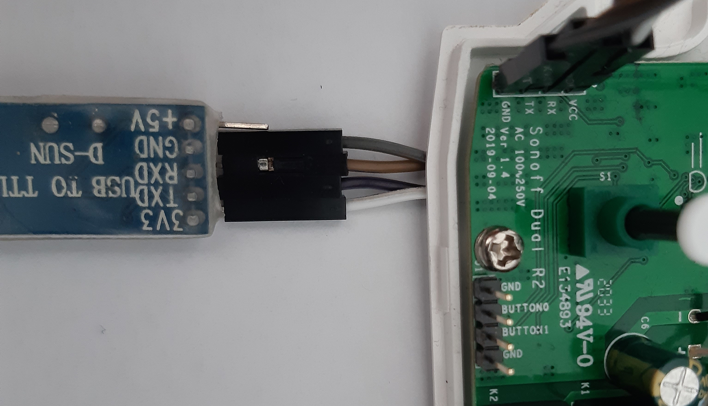

Sonoff Dual R2
==============

> **Do all flashing a.s.o without powering the Sonoff Module with 230V!!**

Last year I bought a Sonoff Dual R2. 

Basically this thing is:

* an ESP8285 MCU 
* with two relays (up to 10A per relay)

And what I like most of this thing, it's very easy to bring your own software to it:

* You just need an USB-TTL Converter that can suppy 3.3V to program it.
* You directly solder connectors to the board.

| FTDI TTL | Sonoff R2 Dual |
|----------|----------------|
| 3V3      | VCC            |
| TX       | RX             |
| RX       | TX             |
| GND      | GND            |

**As a warning on the J1 connector, the bottomost PIN is not connected, it's not connected to GND like the printing on the PCB let you think. At least it's one my PCB of the sonoff**

And it got following components to use:

* Serial interface for programming
* Usable LED
* Usable Button
* Two relays
* Two more GPIOs to use

See [Arduino Program](ArduinoProgram.md) for more details how to use this components.

Flashing
--------
To put the MCU on the Sonoff to programming mode, the *BUTTON0* needs to be connected to *GND* when the Sonoff is powered.

Now the integrated ESP8285 can be flashed using a USB-TTL Converter.

Links
-----
* https://wiki.jmehan.com/pages/viewpage.action?pageId=4489229
