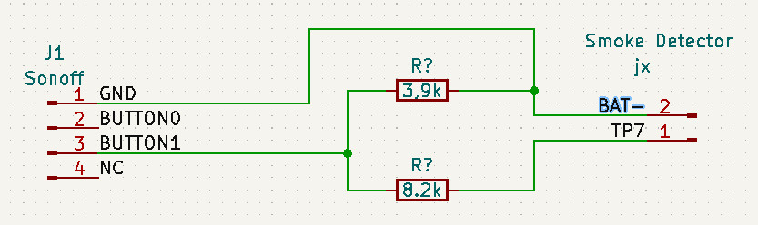
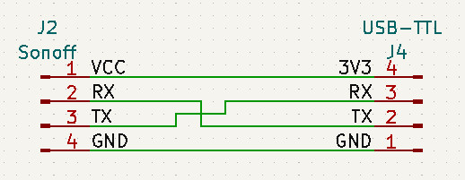

Wiring
======

Smokedetector to Sonoff
-----------------------

The *I/O Pin* available on *TP7* on my smokedetector PCB, is connected over an voltage divider to the *BUTTON1* on the Sonoff.

The negative battery voltage is connected to the *GND* of the Sonoff.

Programming the Sonoff
----------------------
For programming the Sonoff an USB-TTL Converter needs to be connected.

> **Make sure your USB-TTL has 3.3V VCC, or you will grill the MCU on the Sonoff!**

> **DO NOT CONNECT THE SONOFF TO 230V FOR PROGRAMING!**

